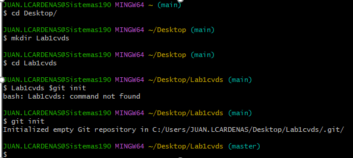
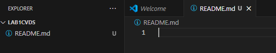
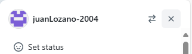
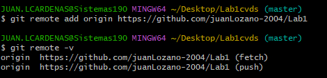
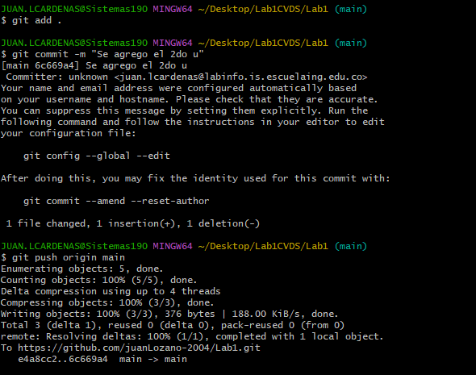
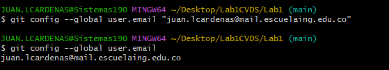

## Primer punto

## Segundo punto

## Tercer punto
Git add: añade el archivo indicado como el próximo para cometer los cambios en la línea add.
Git commit -m: “Mensaje”: Envía los cambios al repositorio junto con un mensaje descriptivo de los cambios generales
## Cuarto punto

## Quinto punto

## Sexto punto

## Septimo punto

## Octavo punto
Se agrega el correo
juan.lcardenas@mail.escuelaing.edu.co con el comando:
git config --global user.email "juan.lcardenas@mail.escuelaing.edu.co"

## Noveno punto
Se actualizo y se reviso en github donde esta al día todos los cambios establecidos
