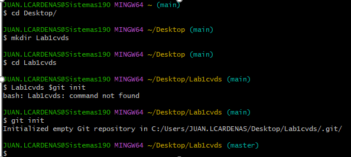

## Primer punto

## Segundo punto
.
## Tercer punto
Git add: añade el archivo indicado como el próximo para cometer los cambios en la línea add.
Git commit -m: “Mensaje”: Envía los cambios al repositorio junto con un mensaje descriptivo de los cambios generales
